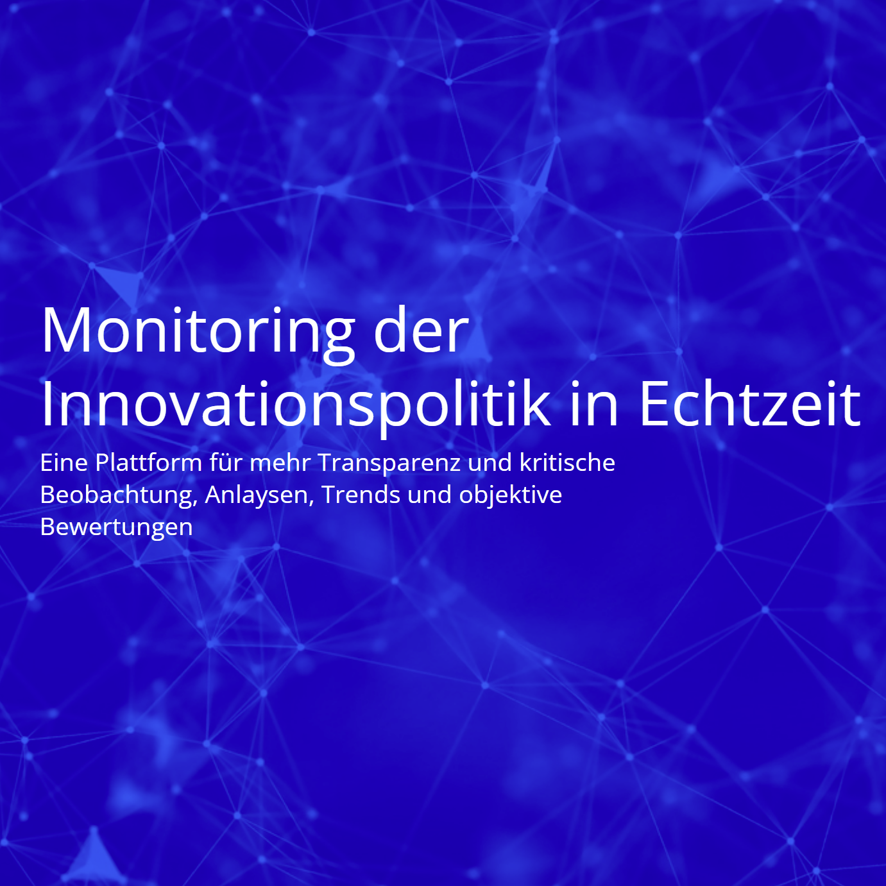
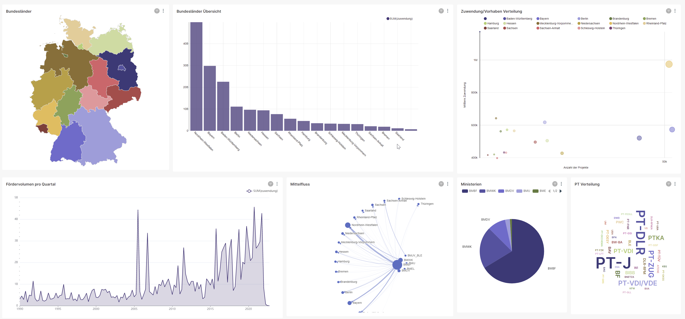
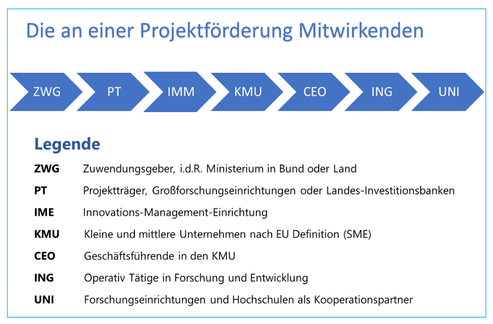
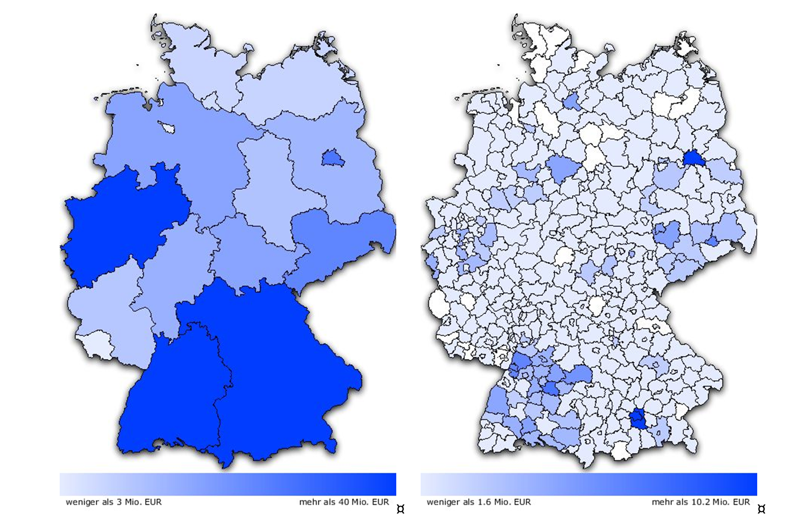
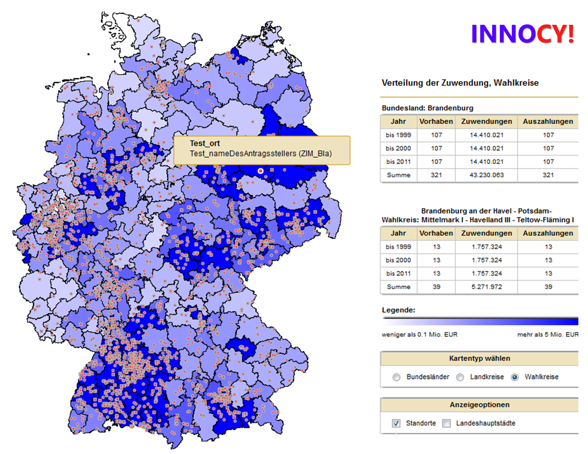

 

# Einleitung

Deutschland ist ein Land, dessen Wohlstand auf der Technologieführerschaft in vielen Bereichen der Industrie beruht. Die Ingenieurkunst ist einer der wichtigsten Rohstoffe, über die es verfügt.

Die Innovationspolitik ist daher ein bedeutendes und anspruchsvolles Themenfeld und rechtfertigt eine intensive und präzise Beobachtung im wirtschaftspolitischen Kontext.

Innovationsprozesse beginnen bei der Ausbildung von Fachkräften, der Grundlagenforschung an Hochschulen und Forschungseinrichtungen, der industriellen Realisierung von Erkenntnissen in kleinen und großen, jungen und alten Unternehmen und reicht bis zur erfolgreichen Verwertung neuer Technologien und Verfahren im weltweiten Wettbewerb.

Zahlreiche Akteure sind an der Ausgestaltung und Begleitung innovationspolitischer Maßnahmen und Prozesse beteiligt. Im Bund, in den Ländern und der EU. 

Täglich werden Beiträge zur Innovationspolitik publiziert. In der Presse erscheinen Kommentare und Empfehlungen, Wirtschaftsverbände äußern sich permanent dazu. Jeder fühlt sich berufen, Impulse und Ratschläge zu verteilen. 

Aber worauf beruhen diese? 

Sie basieren nicht auf ganzheitlichen Erkenntnissen sondern auf punktuell adressierten Problemen und Analysen.  Die Ergebnisse sind oftmals zu negativ ("Wir müssen alles ändern!") von der Politik natürlich zu positiv ("Wir sind sehr erfolgreich!").

Leicht zugängliche, tagesaktuelle, umfängliche Analysen der innovationspolitischen Maßnahmen und Prozesse im Zusammenhang mit der gesamtwirtschaftlichen Situation, gibt es nicht.

# Die Mission

Es soll eine kontinuierliche und unabhängige Beobachtung und objektive Bewertung von innovationspolitischen Maßnahmen und Prozessen entwickelt werden.

Die Grundlage hierfür bilden sowohl frei verfügbare Datenquellen sowie von an den Prozessen beteiligten Akteuren bereitgestellte Informationen. Die vollständige Transparenz der förderpolitischen Maßnahmen ist unbedingt erforderlich, weil hierfür öffentliche Mittel in erheblicher Höhe eingesetzt werden.

Alle Daten werden automatisch aufbereitet, mit modernen Methoden der Data-Science analysiert und durch Hinzufügen von sachkundigen Bewertungen veredelt.

Es handelt sich um eine komplett unabhängige und kritische Beobachtung der Innovationspolitik. Es stehen keine Interessen von Verbänden, Parteien, Projektträgern oder Forschungseinrichtungen dahinter.

Die Wahrung der Unabhängigkeit wird durch öffentliche Transparenz der Datengenerierung gewährleistet und durch eine geeignete Organisationsform kontrolliert.

# Die Roadmap

Zunächst werden Bundesprogramme beobachtet, danach sollen sukzessive Landes- und EU-Programme hinzukommen.

Die Plattform wird komplett als Open-Source Projekt realisiert. Es soll eine aktive Community aufgebaut werden, zu der jeder qualifizierte Beiträge liefern kann.

Beitragskategorien sind:
* Analyse-Modelle
* Software-Komponenten
* Daten
* Kommentare

***Kontinuierliches Monitoring statt isolierter Studien.***

# Wer sind die Zielgruppen?

Allen an den Entscheidungsprozessen Beteiligten in der Wirtschaft, Gesellschaft, Politik und Verwaltung, sollen in übersichtlicher Form (Dashboards, Reports, Wikis) Informationen und Input für ihre Arbeit bereitgestellt werden.

Weiterhin sollen Verbände und Interessenvertretende ein Instrument bekommen, welches sie bei der Verfolgung ihrer Projekte und Anliegen optimal unterstützen kann.
# Wobei kann INNOCY! hilfreich sein?

In erster Linie geht es darum, die Effizienz der Nachverfolgbarkeit von Innovationspolitischen Maßnahmen und Prozessen sichtbar und messbar zu machen und zwar objektiv und gesamtheitlich.

***Was heißt das genau?***

Bisher werden förderpolitische Vorhaben von alle Zuwendungsgebern in Land, Bund und EU unkoordiniert implementiert und jeweils nur in und für sich evaluiert.

Es erfolgt keine vergleichende Analyse von Programmen und Vorhaben zwischen den unterschiedlichen Zuwendungsgebern.

Es geht hierbei nicht um das Aufspüren von Mehrfach-Förderungen oder Überschneidungen sondern um den Versuch, zu messen, ob das insgesamt eingesetzt Geld zu volkswirtschaftlich wertvollen Ergebnissen geführt hat.

Die bisher überwiegend durchgeführten Erhebungen von Seiten der Projektträger und Institute sind nicht objektiv, und werden meistens erst nach Ende eines Programms durchgeführt und haben oft Kriterien mit Befangenheit.

***Begründung***

* Ein Zuwendungsempfänger wird bei der Befragung zur Erfolgskontrolle (schon der Begriff ist unglücklich) mit großer Wahrscheinlichkeit nicht erwähnen, dass sein Vorhaben eigentlich ein Misserfolg war, weil er sich dann in der Gefahr sieht, bei der nächsten Antragstellung schlechter dazustehen und nicht mehr berücksichtigt zu werden. 
  
* Aber auch ein mit der Evaluation beauftragtes Institut, wird niemals erklären, dass ein Förderprogramm seines Auftraggebers nicht erfolgreich war, weil es dann wahrscheinlich keinen Evaluierungsauftrag mehr erhalten wird.

Es ist hier also jeweils ein erheblicher Bias zu erwarten.

***Was bedeutet Messbarkeit?***

Für eine aussagekräftige Analyse sind also messbare Kriterien erforderlich, damit hohe Qualitätsstandards eingehalten werden können. Messbar bedeutet, das es nicht auf subjektiven Einschätzungen oder Prognosen basiert. 

Ein Beispiel: In den Befragungen werden üblicherweise Umsatzerwartungen von geförderten Unternehmen abgefragt, welche somit als Bewertungskriterium nicht infrage kommen.

***Fazit***

Es würde sich also ein viel präziseres Bild ergeben, wenn ausschließlich mit der Verknüpfung und Analyse von eindeutig messbaren Informationen im Kontext der Förderpolitik gearbeitet wird.

# Die Organisation

Es soll von Beginn an ein offenes und transparentes Ökosystem entwickelt werden. Die e Mitarbeit an der Plattform soll für alle Interessierte möglich sein.
Vorbild hierfür sind die im Open-Source-Software Bereich etablierten Foundations, wie z.B. Linux, Apache, Eclipse und viele mehr.

Kernstück soll die sogenannte meritrokratische Organisation sein. Es bedeutet, dass alle Entscheidungen durch die Mehrheit mitgetragen werden müssen. So stimmen die Mitglieder des Community alle gemeinsam über die Aufnahme eines neuen Mitglieds, Übertragung einer verantwortungsvolleren Rolle an ein Mitglied oder auch Vertretung der Projekte im "Board of Directors" ab. Dabei stehen lediglich die individuelle Leistung und Kompetenz des jeweiligen Mitglieds und sein Beitrag zum jeweiligen Projekt bzw. zur Community im Vordergrund. Die Mitglieder sind immer natürliche Personen. Die Zugehörigkeit zu einer bestimmten Organisation spielt dabei keine Rolle.  

Als Rechtsform kann ein Verein oder eine Stiftung gegründet werden.

# Finanzierung

Das Vorhaben soll ausschließlich durch öffentliche Zuwendungen, Beiträge und Spenden finanziert werden. Die Unabhängigkeit darf durch die Finanzierung nicht beeinträchtigt werden.

Alle Ergebnisse sind Open-Data und Open-Source.

# Was INNOCY! nicht sein soll

INNOCY! ist keine Suchmaschine oder ein Recherchetool. Alle Informationen werden entweder maschinell oder redaktionell aufbereitet und publiziert. Daher kann sehr schnell und gezielt auf die gewünschten Inhalten zugegriffen werden. Die Benutzenden können jedoch auch ein eigenes Profil verwalten, mit welchem sich die Vielzahl der Informationen auf den eigenen Interessenbereich eingrenzen lässt.

Manche ähnliche Ansätze für Analyse-Tools von großen Akteuren im "Fördergeschäft", haben jedoch die Entwicklung und Optimierung von Förderinstrumenten, also ihrem Geschäftsmodell, zum Ziel.

***Der Workflow ist also: beobachten, analysieren, kommentieren, publizieren***

# Der Initiator

Roland Kopetsch ist 1962 in Berlin geboren, aufgewachsen, ausgebildet und noch immer wohnhaft. 

Als  Diplom-Ingenieur für Luft- und Raumfahrttechnik beschäftigt er sich seit fast vier Jahrzehnten mit Innovationsprozessen im technologischen Kontext.

Durch seine aktive Mitarbeit als Entwicklungsingenieur in zahlreichen Forschungs- und Entwicklungsprojekten, sind ihm die Perspektiven eines Forschenden vertraut.

Gleichzeitgig arbeitet er seit 1991 für mehrere Projektträger des Bundes und der Länder und unterstützt diese mit seinem Unternehmen bei der Digitalisierung ihrer Geschäftsprozesse.

Die innovationspolitischen Prozesse kennt er also "von zwei Seiten" und verfügt über ein fundiertes Wissen über die Zusammenhänge in der Innovationspipeline und ein großes Netzwerk innerhalb der wichtigen Akteure.

Als geschäftsführender Gesellschafter in einem Technologie-Unternehmen, stehen ihm auch  die Ressourcen und Kompetenzen zur Verfügung, ein so anspruchsvolles Vorhaben erfolgreich zu realisieren.

# Zusammenfassung

Bei INNOCY! handelt es sich um einen komplett neuen Ansatz. Sowohl technologisch, organisatorisch als auch von der inhaltlichen Herangehensweise.

Eine unabhängige Beobachtung und objektive Messung der Wirksamkeit aller innovationspolitischen Maßnahmen und Prozesse ist notwendig, bisher neu und daher einmalig.
